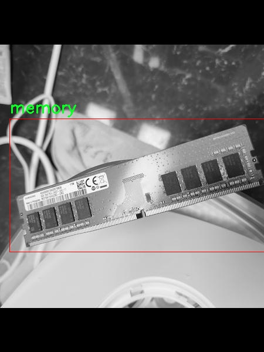
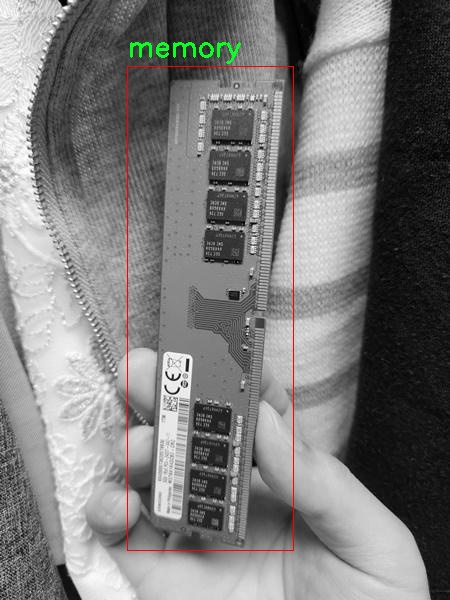

# 改进yolo11-SCConv等200+全套创新点大全：电脑电子元件检测系统源码＆数据集全套

### 1.图片效果展示


##### 项目来源 **[人工智能促进会 2024.10.24](https://kdocs.cn/l/cszuIiCKVNis)**

注意：由于项目一直在更新迭代，上面“1.图片效果展示”和“2.视频效果展示”展示的系统图片或者视频可能为老版本，新版本在老版本的基础上升级如下：（实际效果以升级的新版本为准）

  （1）适配了YOLOV11的“目标检测”模型和“实例分割”模型，通过加载相应的权重（.pt）文件即可自适应加载模型。

  （2）支持“图片识别”、“视频识别”、“摄像头实时识别”三种识别模式。

  （3）支持“图片识别”、“视频识别”、“摄像头实时识别”三种识别结果保存导出，解决手动导出（容易卡顿出现爆内存）存在的问题，识别完自动保存结果并导出到tempDir中。

  （4）支持Web前端系统中的标题、背景图等自定义修改。

  另外本项目提供训练的数据集和训练教程,暂不提供权重文件（best.pt）,需要您按照教程进行训练后实现图片演示和Web前端界面演示的效果。

### 2.视频效果展示

[2.1 视频效果展示](https://www.bilibili.com/video/BV142yyYxEi8/)

### 3.背景

研究背景与意义

随着信息技术的迅猛发展，电子元件的应用范围不断扩大，特别是在计算机硬件领域，电子元件的种类和数量日益增加。为了确保电子产品的质量和性能，准确、高效地检测和识别各种电子元件成为了一个亟待解决的问题。传统的人工检测方法不仅耗时耗力，而且容易受到人为因素的影响，导致检测结果的不稳定性。因此，开发一种基于深度学习的自动化检测系统显得尤为重要。

在众多深度学习模型中，YOLO（You Only Look Once）系列因其高效的实时目标检测能力而受到广泛关注。YOLOv11作为该系列的最新版本，具备更强的特征提取能力和更快的处理速度，能够在复杂的环境中实现高精度的目标检测。为了适应电子元件的检测需求，本研究将对YOLOv11进行改进，旨在提升其在特定类别（如CPU、硬盘、GBIC、内存和网卡等）检测中的性能。

本项目的数据集包含2300张图像，涵盖了三类主要电子元件。这一数据集的构建为模型的训练和评估提供了坚实的基础。通过对数据集的深入分析与处理，结合改进后的YOLOv11模型，我们期望能够实现对电子元件的高效检测与分类，从而为电子产品的生产和质量控制提供有力支持。

综上所述，基于改进YOLOv11的电脑电子元件检测系统不仅具有重要的学术价值，还有助于推动电子行业的智能化发展。通过提升检测效率和准确性，该系统将为电子元件的自动化生产提供新思路，进而推动整个行业的技术进步与创新。

### 4.数据集信息展示

##### 4.1 本项目数据集详细数据（类别数＆类别名）

nc: 5
names: ['cpu', 'disk', 'gbic', 'memory', 'nic']


该项目为【目标检测】数据集，请在【训练教程和Web端加载模型教程（第三步）】这一步的时候按照【目标检测】部分的教程来训练

##### 4.2 本项目数据集信息介绍

本项目数据集信息介绍

本项目所使用的数据集名为“Capstone”，其主要目的是为了训练和改进YOLOv11模型，以实现高效的电脑电子元件检测系统。该数据集包含五个类别，分别是中央处理器（CPU）、硬盘（Disk）、光纤收发器（GBIC）、内存条（Memory）和网络接口卡（NIC）。这些类别的选择不仅反映了现代计算机系统中关键组件的多样性，也为系统的检测精度和效率提供了丰富的训练样本。

“Capstone”数据集的构建过程经过精心设计，确保每个类别的样本在数量和质量上都能满足深度学习模型的训练需求。数据集中包含了多种不同品牌、型号和规格的电子元件图像，这些图像在不同的光照条件、角度和背景下拍摄，旨在增强模型的泛化能力和鲁棒性。通过多样化的样本，模型能够更好地适应实际应用场景中可能遇到的各种变化，从而提高检测的准确性。

此外，数据集还附带了详细的标注信息，确保每个图像中的电子元件都被准确地标识和分类。这种高质量的标注不仅有助于训练阶段的监督学习，也为后续的模型评估和优化提供了可靠的依据。通过使用“Capstone”数据集，我们期望能够有效提升YOLOv11在电子元件检测任务中的表现，使其在实际应用中能够快速、准确地识别和分类各类电脑电子元件，为相关行业的自动化和智能化发展提供强有力的技术支持。







### 5.全套项目环境部署视频教程（零基础手把手教学）

[5.1 所需软件PyCharm和Anaconda安装教程（第一步）](https://www.bilibili.com/video/BV1BoC1YCEKi/?spm_id_from=333.999.0.0&vd_source=bc9aec86d164b67a7004b996143742dc)


[5.2 安装Python虚拟环境创建和依赖库安装视频教程（第二步）](https://www.bilibili.com/video/BV1ZoC1YCEBw?spm_id_from=333.788.videopod.sections&vd_source=bc9aec86d164b67a7004b996143742dc)

### 6.改进YOLOv11训练教程和Web_UI前端加载模型教程（零基础手把手教学）

[6.1 改进YOLOv11训练教程和Web_UI前端加载模型教程（第三步）](https://www.bilibili.com/video/BV1BoC1YCEhR?spm_id_from=333.788.videopod.sections&vd_source=bc9aec86d164b67a7004b996143742dc)


按照上面的训练视频教程链接加载项目提供的数据集，运行train.py即可开始训练



     Epoch   gpu_mem       box       obj       cls    labels  img_size
     1/200     20.8G   0.01576   0.01955  0.007536        22      1280: 100%|██████████| 849/849 [14:42<00:00,  1.04s/it]
               Class     Images     Labels          P          R     mAP@.5 mAP@.5:.95: 100%|██████████| 213/213 [01:14<00:00,  2.87it/s]
                 all       3395      17314      0.994      0.957      0.0957      0.0843

     Epoch   gpu_mem       box       obj       cls    labels  img_size
     2/200     20.8G   0.01578   0.01923  0.007006        22      1280: 100%|██████████| 849/849 [14:44<00:00,  1.04s/it]
               Class     Images     Labels          P          R     mAP@.5 mAP@.5:.95: 100%|██████████| 213/213 [01:12<00:00,  2.95it/s]
                 all       3395      17314      0.996      0.956      0.0957      0.0845

     Epoch   gpu_mem       box       obj       cls    labels  img_size
     3/200     20.8G   0.01561    0.0191  0.006895        27      1280: 100%|██████████| 849/849 [10:56<00:00,  1.29it/s]
               Class     Images     Labels          P          R     mAP@.5 mAP@.5:.95: 100%|███████   | 187/213 [00:52<00:00,  4.04it/s]
                 all       3395      17314      0.996      0.957      0.0957      0.0845


###### [项目数据集下载链接](https://kdocs.cn/l/cszuIiCKVNis)

### 7.原始YOLOv11算法讲解

##### YOLO11简介

> YOLO11源码地址：https://github.com/ultralytics/ultralytics

Ultralytics
YOLO11是一款尖端的、最先进的模型，它在之前YOLO版本成功的基础上进行了构建，并引入了新功能和改进，以进一步提升性能和灵活性。YOLO11设计快速、准确且易于使用，使其成为各种物体检测和跟踪、实例分割、图像分类以及姿态估计任务的绝佳选择。  


**YOLO11创新点如下:**

YOLO 11主要改进包括：  
`增强的特征提取`：YOLO 11采用了改进的骨干和颈部架构，增强了特征提取功能，以实现更精确的目标检测。  
`优化的效率和速度`：优化的架构设计和优化的训练管道提供更快的处理速度，同时保持准确性和性能之间的平衡。  
`更高的精度，更少的参数`：YOLO11m在COCO数据集上实现了更高的平均精度（mAP），参数比YOLOv8m少22%，使其在不影响精度的情况下提高了计算效率。  
`跨环境的适应性`：YOLO 11可以部署在各种环境中，包括边缘设备、云平台和支持NVIDIA GPU的系统。  
`广泛的支持任务`：YOLO 11支持各种计算机视觉任务，如对象检测、实例分割、图像分类、姿态估计和面向对象检测（OBB）。

**YOLO11不同模型尺寸信息：**

YOLO11 提供5种不同的型号规模模型，以满足不同的应用需求：

Model| size (pixels)| mAPval 50-95| Speed CPU ONNX (ms)| Speed T4 TensorRT10
(ms)| params (M)| FLOPs (B)  
---|---|---|---|---|---|---  
YOLO11n| 640| 39.5| 56.1 ± 0.8| 1.5 ± 0.0| 2.6| 6.5  
YOLO11s| 640| 47.0| 90.0 ± 1.2| 2.5 ± 0.0| 9.4| 21.5  
YOLO11m| 640| 51.5| 183.2 ± 2.0| 4.7 ± 0.1| 20.1| 68.0  
YOLO11l| 640| 53.4| 238.6 ± 1.4| 6.2 ± 0.1| 25.3| 86.9  
YOLO11x| 640| 54.7| 462.8 ± 6.7| 11.3 ± 0.2| 56.9| 194.9  
  
**模型常用训练超参数参数说明：**  
`YOLOv11
模型的训练设置包括训练过程中使用的各种超参数和配置`。这些设置会影响模型的性能、速度和准确性。关键的训练设置包括批量大小、学习率、动量和权重衰减。此外，优化器、损失函数和训练数据集组成的选择也会影响训练过程。对这些设置进行仔细的调整和实验对于优化性能至关重要。  
**以下是一些常用的模型训练参数和说明：**

参数名| 默认值| 说明  
---|---|---  
`model`| `None`| 指定用于训练的模型文件。接受指向 `.pt` 预训练模型或 `.yaml`
配置文件。对于定义模型结构或初始化权重至关重要。  
`data`| `None`| 数据集配置文件的路径（例如
`coco8.yaml`).该文件包含特定于数据集的参数，包括训练数据和验证数据的路径、类名和类数。  
`epochs`| `100`| 训练总轮数。每个epoch代表对整个数据集进行一次完整的训练。调整该值会影响训练时间和模型性能。  
`patience`| `100`| 在验证指标没有改善的情况下，提前停止训练所需的epoch数。当性能趋于平稳时停止训练，有助于防止过度拟合。  
`batch`| `16`| 批量大小，有三种模式:设置为整数(例如，’ Batch =16 ‘)， 60% GPU内存利用率的自动模式(’ Batch
=-1 ‘)，或指定利用率分数的自动模式(’ Batch =0.70 ')。  
`imgsz`| `640`| 用于训练的目标图像尺寸。所有图像在输入模型前都会被调整到这一尺寸。影响模型精度和计算复杂度。  
`device`| `None`| 指定用于训练的计算设备：单个 GPU (`device=0`）、多个 GPU (`device=0,1`)、CPU
(`device=cpu`)，或苹果芯片的 MPS (`device=mps`).  
`workers`| `8`| 加载数据的工作线程数（每 `RANK` 多 GPU 训练）。影响数据预处理和输入模型的速度，尤其适用于多 GPU 设置。  
`name`| `None`| 训练运行的名称。用于在项目文件夹内创建一个子目录，用于存储训练日志和输出结果。  
`pretrained`| `True`| 决定是否从预处理模型开始训练。可以是布尔值，也可以是加载权重的特定模型的字符串路径。提高训练效率和模型性能。  
`optimizer`| `'auto'`| 为训练模型选择优化器。选项包括 `SGD`, `Adam`, `AdamW`, `NAdam`,
`RAdam`, `RMSProp` 等，或 `auto` 用于根据模型配置进行自动选择。影响收敛速度和稳定性  
`lr0`| `0.01`| 初始学习率（即 `SGD=1E-2`, `Adam=1E-3`) .调整这个值对优化过程至关重要，会影响模型权重的更新速度。  
`lrf`| `0.01`| 最终学习率占初始学习率的百分比 = (`lr0 * lrf`)，与调度程序结合使用，随着时间的推移调整学习率。  


**各损失函数作用说明：**  
`定位损失box_loss`：预测框与标定框之间的误差（GIoU），越小定位得越准；  
`分类损失cls_loss`：计算锚框与对应的标定分类是否正确，越小分类得越准；  
`动态特征损失（dfl_loss）`：DFLLoss是一种用于回归预测框与目标框之间距离的损失函数。在计算损失时，目标框需要缩放到特征图尺度，即除以相应的stride，并与预测的边界框计算Ciou
Loss，同时与预测的anchors中心点到各边的距离计算回归DFLLoss。  


### 8.200+种全套改进YOLOV11创新点原理讲解

#### 8.1 200+种全套改进YOLOV11创新点原理讲解大全

由于篇幅限制，每个创新点的具体原理讲解就不全部展开，具体见下列网址中的改进模块对应项目的技术原理博客网址【Blog】（创新点均为模块化搭建，原理适配YOLOv5~YOLOv11等各种版本）

[改进模块技术原理博客【Blog】网址链接](https://gitee.com/qunmasj/good)


#### 8.2 精选部分改进YOLOV11创新点原理讲解

###### 这里节选部分改进创新点展开原理讲解(完整的改进原理见上图和[改进模块技术原理博客链接](https://gitee.com/qunmasj/good)【如果此小节的图加载失败可以通过CSDN或者Github搜索该博客的标题访问原始博客，原始博客图片显示正常】

### Gold-YOLO


#### Preliminaries
YOLO系列的中间层结构采用了传统的FPN结构，其中包含多个分支用于多尺度特征融合。然而，它只充分融合来自相邻级别的特征，对于其他层次的信息只能间接地进行“递归”获取。

传统的FPN结构在信息传输过程中存在丢失大量信息的问题。这是因为层之间的信息交互仅限于中间层选择的信息，未被选择的信息在传输过程中被丢弃。这种情况导致某个Level的信息只能充分辅助相邻层，而对其他全局层的帮助较弱。因此，整体上信息融合的有效性可能受到限制。
为了避免在传输过程中丢失信息，本文采用了一种新颖的“聚集和分发”机制（GD），放弃了原始的递归方法。该机制使用一个统一的模块来收集和融合所有Level的信息，并将其分发到不同的Level。通过这种方式，作者不仅避免了传统FPN结构固有的信息丢失问题，还增强了中间层的部分信息融合能力，而且并没有显著增加延迟。


#### 低阶聚合和分发分支 Low-stage gather-and-distribute branch
从主干网络中选择输出的B2、B3、B4、B5特征进行融合，以获取保留小目标信息的高分辨率特征。


#### 高阶聚合和分发分支 High-stage gather-and-distribute branch
高级全局特征对齐模块（High-GD）将由低级全局特征对齐模块（Low-GD）生成的特征{P3, P4, P5}进行融合。


Transformer融合模块由多个堆叠的transformer组成，transformer块的数量为L。每个transformer块包括一个多头注意力块、一个前馈网络（FFN）和残差连接。采用与LeViT相同的设置来配置多头注意力块，使用16个通道作为键K和查询Q的头维度，32个通道作为值V的头维度。为了加速推理过程，将层归一化操作替换为批归一化，并将所有的GELU激活函数替换为ReLU。为了增强变换器块的局部连接，在两个1x1卷积层之间添加了一个深度卷积层。同时，将FFN的扩展因子设置为2，以在速度和计算成本之间取得平衡。


信息注入模块(Information injection module)： 高级全局特征对齐模块（High-GD）中的信息注入模块与低级全局特征对齐模块（Low-GD）中的相同。在高级阶段，局部特征（Flocal）等于Pi，因此公式如下所示：


#### 增强的跨层信息流动 Enhanced cross-layer information flow
为了进一步提升性能，从YOLOv6 中的PAFPN模块中得到启发，引入了Inject-LAF模块。该模块是注入模块的增强版，包括了一个轻量级相邻层融合（LAF）模块，该模块被添加到注入模块的输入位置。为了在速度和准确性之间取得平衡，设计了两个LAF模型：LAF低级模型和LAF高级模型，分别用于低级注入（合并相邻两层的特征）和高级注入（合并相邻一层的特征）。它们的结构如图5(b)所示。为了确保来自不同层级的特征图与目标大小对齐，在实现中的两个LAF模型仅使用了三个操作符：双线性插值（上采样过小的特征）、平均池化（下采样过大的特征）和1x1卷积（调整与目标通道不同的特征）。模型中的LAF模块与信息注入模块的结合有效地平衡了准确性和速度之间的关系。通过使用简化的操作，能够增加不同层级之间的信息流路径数量，从而提高性能而不显著增加延迟。


### 9.系统功能展示

图9.1.系统支持检测结果表格显示

  图9.2.系统支持置信度和IOU阈值手动调节

  图9.3.系统支持自定义加载权重文件best.pt(需要你通过步骤5中训练获得)

  图9.4.系统支持摄像头实时识别

  图9.5.系统支持图片识别

  图9.6.系统支持视频识别

  图9.7.系统支持识别结果文件自动保存

  图9.8.系统支持Excel导出检测结果数据


### 10. YOLOv11核心改进源码讲解

#### 10.1 activation.py

以下是对给定代码的核心部分进行提炼和详细注释的结果：

```python
import torch
import torch.nn as nn

class AGLU(nn.Module):
    """AGLU激活函数模块，来源于https://github.com/kostas1515/AGLU。"""

    def __init__(self, device=None, dtype=None) -> None:
        """初始化AGLU激活函数模块。
        
        参数:
        device: 指定张量存储的设备（如CPU或GPU）。
        dtype: 指定张量的数据类型（如float32）。
        """
        super().__init__()
        # 使用Softplus作为基础激活函数，beta设为-1.0
        self.act = nn.Softplus(beta=-1.0)
        # 初始化lambda参数，并将其设为可学习参数
        self.lambd = nn.Parameter(nn.init.uniform_(torch.empty(1, device=device, dtype=dtype)))  
        # 初始化kappa参数，并将其设为可学习参数
        self.kappa = nn.Parameter(nn.init.uniform_(torch.empty(1, device=device, dtype=dtype)))  

    def forward(self, x: torch.Tensor) -> torch.Tensor:
        """计算AGLU激活函数的前向传播。
        
        参数:
        x: 输入张量。
        
        返回:
        经过AGLU激活函数处理后的输出张量。
        """
        # 将lambda参数限制在最小值0.0001，以避免除零错误
        lam = torch.clamp(self.lambd, min=0.0001)
        # 计算AGLU激活函数的输出
        return torch.exp((1 / lam) * self.act((self.kappa * x) - torch.log(lam)))
```

### 代码核心部分说明：
1. **AGLU类**：这是一个自定义的激活函数模块，继承自`nn.Module`，用于实现AGLU激活函数。
2. **初始化方法**：
   - `self.act`：使用`Softplus`作为基础激活函数。
   - `self.lambd`和`self.kappa`：这两个参数是可学习的，并且在初始化时使用均匀分布随机生成。
3. **前向传播方法**：
   - 输入张量`x`经过`kappa`参数的缩放和`lambda`参数的对数处理后，使用`Softplus`激活函数进行处理。
   - 最后，计算结果通过指数函数进行转换，形成AGLU激活函数的输出。

### 注意事项：
- 该激活函数的设计考虑了可学习参数的引入，使得模型在训练过程中能够自适应调整激活函数的形状，从而提高模型的表达能力。

这个文件名为 `activation.py`，主要实现了一个名为 AGLU 的激活函数模块。该模块是基于 PyTorch 框架构建的，属于深度学习中的激活函数实现部分。

首先，文件导入了 PyTorch 的核心库 `torch` 和神经网络模块 `torch.nn`。接着，定义了一个名为 `AGLU` 的类，该类继承自 `nn.Module`，这是 PyTorch 中所有神经网络模块的基类。

在 `AGLU` 类的构造函数 `__init__` 中，首先调用了父类的构造函数。然后，定义了一个激活函数 `self.act`，使用了 `nn.Softplus`，其参数 `beta` 被设置为 -1.0。`Softplus` 是一种平滑的激活函数，通常用于替代 ReLU 函数。接下来，定义了两个可学习的参数 `self.lambd` 和 `self.kappa`，这两个参数通过均匀分布初始化，并且可以在训练过程中进行优化。`nn.Parameter` 的使用使得这两个参数能够被自动加入到模型的参数列表中。

在 `forward` 方法中，定义了前向传播的逻辑。该方法接收一个张量 `x` 作为输入，并计算激活函数的输出。首先，通过 `torch.clamp` 函数将 `self.lambd` 限制在一个最小值 0.0001 以上，以避免在后续计算中出现数值不稳定的情况。然后，使用公式计算激活值：先计算 `self.kappa * x`，再减去 `torch.log(lam)`，接着将结果传入 `self.act`，最后通过指数函数 `torch.exp` 得到最终的输出。

总的来说，这个模块实现了一个统一的激活函数，结合了可学习的参数，以便在训练过程中根据数据自适应调整激活函数的形状，从而提高模型的表现。

#### 10.2 SMPConv.py

以下是经过简化并添加详细中文注释的核心代码部分：

```python
import torch
import torch.nn as nn
import torch.nn.functional as F

# 定义一个相对位置的函数，用于生成卷积核的坐标
def rel_pos(kernel_size):
    # 生成一个从-1到1的线性空间，作为卷积核的坐标
    tensors = [torch.linspace(-1, 1, steps=kernel_size) for _ in range(2)]
    kernel_coord = torch.stack(torch.meshgrid(*tensors), dim=-0)  # 生成网格坐标
    kernel_coord = kernel_coord.unsqueeze(0)  # 增加一个维度
    return kernel_coord

# 定义自定义卷积层
class SMPConv(nn.Module):
    def __init__(self, planes, kernel_size, n_points, stride, padding, groups):
        super().__init__()

        self.planes = planes  # 输出通道数
        self.kernel_size = kernel_size  # 卷积核大小
        self.n_points = n_points  # 关键点数量
        self.init_radius = 2 * (2/kernel_size)  # 初始化半径

        # 生成卷积核坐标
        kernel_coord = rel_pos(kernel_size)
        self.register_buffer('kernel_coord', kernel_coord)  # 注册为缓冲区

        # 初始化权重坐标
        weight_coord = torch.empty(1, n_points, 2)
        nn.init.trunc_normal_(weight_coord, std=0.2, a=-1., b=1.)  # 截断正态分布初始化
        self.weight_coord = nn.Parameter(weight_coord)  # 注册为可学习参数

        # 初始化半径
        self.radius = nn.Parameter(torch.empty(1, n_points).unsqueeze(-1).unsqueeze(-1))
        self.radius.data.fill_(value=self.init_radius)  # 填充初始值

        # 初始化权重
        weights = torch.empty(1, planes, n_points)
        nn.init.trunc_normal_(weights, std=.02)  # 截断正态分布初始化
        self.weights = nn.Parameter(weights)  # 注册为可学习参数

    def forward(self, x):
        # 生成卷积核并进行卷积操作
        kernels = self.make_kernels().unsqueeze(1)  # 生成卷积核
        x = x.contiguous()  # 确保输入张量是连续的
        kernels = kernels.contiguous()  # 确保卷积核是连续的

        # 根据输入数据类型选择合适的卷积实现
        if x.dtype == torch.float32:
            x = _DepthWiseConv2dImplicitGEMMFP32.apply(x, kernels)  # FP32卷积
        elif x.dtype == torch.float16:
            x = _DepthWiseConv2dImplicitGEMMFP16.apply(x, kernels)  # FP16卷积
        else:
            raise TypeError("Only support fp32 and fp16, get {}".format(x.dtype))  # 类型错误

        return x        

    def make_kernels(self):
        # 计算卷积核
        diff = self.weight_coord.unsqueeze(-2) - self.kernel_coord.reshape(1, 2, -1).transpose(1, 2)  # 计算差值
        diff = diff.transpose(2, 3).reshape(1, self.n_points, 2, self.kernel_size, self.kernel_size)  # 重塑形状
        diff = F.relu(1 - torch.sum(torch.abs(diff), dim=2) / self.radius)  # 计算ReLU激活后的差值
        
        # 计算最终的卷积核
        kernels = torch.matmul(self.weights, diff.reshape(1, self.n_points, -1))  # 加权求和
        kernels = kernels.reshape(1, self.planes, *self.kernel_coord.shape[2:])  # 重塑形状
        kernels = kernels.squeeze(0)  # 去掉多余的维度
        kernels = torch.flip(kernels.permute(0, 2, 1), dims=(1,))  # 翻转卷积核
        return kernels

# 定义一个简单的卷积块
class SMPCNN(nn.Module):
    def __init__(self, in_channels, out_channels, kernel_size, stride, groups, n_points=None):
        super().__init__()
        padding = kernel_size // 2  # 计算填充
        self.smp = SMPConv(in_channels, kernel_size, n_points, stride, padding, groups)  # 自定义卷积层
        self.small_conv = nn.Conv2d(in_channels, out_channels, kernel_size=5, stride=stride, padding=2, groups=groups)  # 小卷积层

    def forward(self, inputs):
        # 前向传播
        out = self.smp(inputs)  # 通过自定义卷积层
        out += self.small_conv(inputs)  # 加上小卷积层的输出
        return out

# 定义一个完整的块
class SMPBlock(nn.Module):
    def __init__(self, in_channels, dw_channels, lk_size, drop_path):
        super().__init__()
        self.pw1 = nn.Sequential(nn.Conv2d(in_channels, dw_channels, kernel_size=1), nn.BatchNorm2d(dw_channels), nn.ReLU())  # 1x1卷积
        self.pw2 = nn.Conv2d(dw_channels, in_channels, kernel_size=1)  # 1x1卷积
        self.large_kernel = SMPCNN(in_channels=dw_channels, out_channels=dw_channels, kernel_size=lk_size, stride=1, groups=dw_channels)  # 大卷积层
        self.drop_path = nn.Identity()  # 跳过路径

    def forward(self, x):
        out = self.pw1(x)  # 通过第一个卷积层
        out = self.large_kernel(out)  # 通过大卷积层
        out = self.pw2(out)  # 通过第二个卷积层
        return x + self.drop_path(out)  # 残差连接
```

### 代码说明：
1. **rel_pos函数**：生成卷积核的相对坐标，用于计算卷积操作。
2. **SMPConv类**：自定义卷积层，使用特定的卷积核生成方式和权重调整。
3. **SMPCNN类**：组合了自定义卷积层和小卷积层的网络结构。
4. **SMPBlock类**：构建了一个完整的模块，包含多个卷积层和残差连接。 

以上代码是实现深度学习模型中的卷积操作的核心部分，主要用于构建复杂的卷积神经网络。

这个程序文件`SMPConv.py`实现了一个名为SMPConv的自定义卷积层以及一些相关的网络模块，主要用于深度学习中的卷积神经网络（CNN）。文件中使用了PyTorch框架，并包含了一些高级的卷积操作和结构设计。

首先，文件导入了必要的库，包括PyTorch的核心模块和一些自定义的模块。接着，定义了一个辅助函数`rel_pos`，用于生成相对位置的坐标张量，这在卷积操作中可能用于计算卷积核的位置。

`SMPConv`类是文件的核心部分，继承自`nn.Module`。在其构造函数中，初始化了一些参数，包括输出通道数、卷积核大小、点数、步幅、填充和分组数。通过调用`rel_pos`函数生成卷积核的坐标，并注册为缓冲区。接着，初始化了权重坐标和半径，并定义了权重参数。`forward`方法实现了前向传播，使用了深度可分离卷积的实现，支持FP32和FP16两种数据类型。

`make_kernels`方法用于生成卷积核。它通过计算权重坐标与卷积核坐标之间的差异，并应用ReLU激活函数，最终生成卷积核的权重。

`radius_clip`方法用于限制半径的范围，确保其在指定的最小值和最大值之间。

接下来，文件定义了一些辅助函数，例如`get_conv2d`用于根据条件选择使用自定义的SMPConv或标准的卷积层，`get_bn`用于选择使用同步批归一化或普通批归一化，`conv_bn`和`conv_bn_relu`用于构建包含卷积、批归一化和激活函数的序列模块。

`SMPCNN`类是一个更复杂的网络模块，结合了SMPConv和一个小卷积层。它在前向传播中将两个输出相加，以实现特征的融合。

`SMPCNN_ConvFFN`类实现了一个前馈网络模块，包含两个逐点卷积层和一个GELU激活函数。它使用了DropPath技术来实现随机深度，增强模型的鲁棒性。

最后，`SMPBlock`类是一个组合模块，包含两个逐点卷积和一个大型卷积模块，构成了一个更复杂的块结构。它同样使用了DropPath和批归一化。

总体来说，这个文件实现了一个灵活且高效的卷积模块，结合了深度可分离卷积和特征融合的策略，适用于现代卷积神经网络的设计。

#### 10.3 wtconv2d.py

以下是经过简化和注释的核心代码部分：

```python
import torch
import torch.nn as nn
import torch.nn.functional as F
import pywt

def create_wavelet_filter(wave, in_size, out_size, type=torch.float):
    # 创建小波滤波器
    w = pywt.Wavelet(wave)  # 使用pywt库创建小波对象
    # 反转小波的分解高通和低通滤波器
    dec_hi = torch.tensor(w.dec_hi[::-1], dtype=type)
    dec_lo = torch.tensor(w.dec_lo[::-1], dtype=type)
    # 生成分解滤波器
    dec_filters = torch.stack([
        dec_lo.unsqueeze(0) * dec_lo.unsqueeze(1),
        dec_lo.unsqueeze(0) * dec_hi.unsqueeze(1),
        dec_hi.unsqueeze(0) * dec_lo.unsqueeze(1),
        dec_hi.unsqueeze(0) * dec_hi.unsqueeze(1)
    ], dim=0)
    dec_filters = dec_filters[:, None].repeat(in_size, 1, 1, 1)  # 扩展到输入通道数

    # 反转小波的重构高通和低通滤波器
    rec_hi = torch.tensor(w.rec_hi[::-1], dtype=type).flip(dims=[0])
    rec_lo = torch.tensor(w.rec_lo[::-1], dtype=type).flip(dims=[0])
    # 生成重构滤波器
    rec_filters = torch.stack([
        rec_lo.unsqueeze(0) * rec_lo.unsqueeze(1),
        rec_lo.unsqueeze(0) * rec_hi.unsqueeze(1),
        rec_hi.unsqueeze(0) * rec_lo.unsqueeze(1),
        rec_hi.unsqueeze(0) * rec_hi.unsqueeze(1)
    ], dim=0)
    rec_filters = rec_filters[:, None].repeat(out_size, 1, 1, 1)  # 扩展到输出通道数

    return dec_filters, rec_filters  # 返回分解和重构滤波器

def wavelet_transform(x, filters):
    # 小波变换
    b, c, h, w = x.shape  # 获取输入的形状
    pad = (filters.shape[2] // 2 - 1, filters.shape[3] // 2 - 1)  # 计算填充
    x = F.conv2d(x, filters.to(x.dtype).to(x.device), stride=2, groups=c, padding=pad)  # 进行卷积
    x = x.reshape(b, c, 4, h // 2, w // 2)  # 重塑输出形状
    return x

def inverse_wavelet_transform(x, filters):
    # 反小波变换
    b, c, _, h_half, w_half = x.shape  # 获取输入的形状
    pad = (filters.shape[2] // 2 - 1, filters.shape[3] // 2 - 1)  # 计算填充
    x = x.reshape(b, c * 4, h_half, w_half)  # 重塑输入形状
    x = F.conv_transpose2d(x, filters.to(x.dtype).to(x.device), stride=2, groups=c, padding=pad)  # 进行反卷积
    return x

class WaveletTransform(Function):
    @staticmethod
    def forward(ctx, input, filters):
        ctx.filters = filters  # 保存滤波器
        with torch.no_grad():
            x = wavelet_transform(input, filters)  # 执行小波变换
        return x

    @staticmethod
    def backward(ctx, grad_output):
        grad = inverse_wavelet_transform(grad_output, ctx.filters)  # 计算梯度
        return grad, None

class WTConv2d(nn.Module):
    def __init__(self, in_channels, out_channels, kernel_size=5, stride=1, bias=True, wt_levels=1, wt_type='db1'):
        super(WTConv2d, self).__init__()
        assert in_channels == out_channels  # 输入和输出通道数必须相同

        self.in_channels = in_channels
        self.wt_levels = wt_levels
        self.stride = stride

        # 创建小波滤波器
        self.wt_filter, self.iwt_filter = create_wavelet_filter(wt_type, in_channels, in_channels, torch.float)
        self.wt_filter = nn.Parameter(self.wt_filter, requires_grad=False)  # 将滤波器设置为不可训练参数
        self.iwt_filter = nn.Parameter(self.iwt_filter, requires_grad=False)

        # 定义基础卷积层
        self.base_conv = nn.Conv2d(in_channels, in_channels, kernel_size, padding='same', stride=1, groups=in_channels, bias=bias)

    def forward(self, x):
        # 前向传播
        x = self.base_conv(x)  # 先进行基础卷积
        return x  # 返回卷积结果
```

### 代码注释说明：
1. **create_wavelet_filter**: 创建小波变换所需的分解和重构滤波器。
2. **wavelet_transform**: 实现小波变换，通过卷积操作提取特征。
3. **inverse_wavelet_transform**: 实现反小波变换，通过反卷积操作重构特征。
4. **WaveletTransform**: 定义小波变换的前向和反向传播。
5. **WTConv2d**: 定义小波卷积层，包含基础卷积和小波变换的逻辑。

该代码的核心功能是实现小波变换和反变换，并将其集成到卷积神经网络中。

这个程序文件 `wtconv2d.py` 实现了一个基于小波变换的二维卷积层，主要用于图像处理和特征提取。文件中使用了 PyTorch 框架，结合了小波变换的数学原理，以增强卷积操作的表现力。

首先，程序导入了必要的库，包括 PyTorch 的核心模块、神经网络模块、功能模块，以及用于小波变换的 `pywt` 库。接着，定义了一个创建小波滤波器的函数 `create_wavelet_filter`，该函数接受小波类型、输入通道数和输出通道数作为参数。它使用 `pywt` 库生成小波的分解和重构滤波器，并将其转换为 PyTorch 张量。

接下来，定义了两个函数 `wavelet_transform` 和 `inverse_wavelet_transform`，分别用于执行小波变换和逆小波变换。这两个函数通过卷积操作来实现小波变换，并在变换过程中进行必要的形状调整。

随后，定义了两个类 `WaveletTransform` 和 `InverseWaveletTransform`，它们继承自 `Function` 类，分别实现了小波变换和逆小波变换的前向和反向传播。通过这两个类，可以在训练过程中计算梯度。

在 `WTConv2d` 类中，构造函数初始化了小波卷积层的各个参数，包括输入和输出通道数、卷积核大小、步幅、偏置等。它还创建了小波变换和逆变换的滤波器，并定义了基本的卷积操作。通过 `nn.ModuleList`，该类支持多层小波卷积操作，并为每层定义了缩放模块。

在 `forward` 方法中，输入数据首先经过小波变换，得到低频和高频特征。随后，这些特征通过一系列卷积和缩放操作进行处理，最后再通过逆小波变换恢复到原始的特征空间。这个过程确保了小波变换和卷积操作的结合，能够提取出更加丰富的特征。

最后，定义了一个 `_ScaleModule` 类，用于实现特征的缩放操作。这个模块包含一个可学习的权重参数，能够对输入特征进行加权处理。

整体来看，这个程序文件通过结合小波变换和卷积操作，提供了一种新的特征提取方式，适用于图像处理等任务。小波变换的引入使得模型能够更好地捕捉图像中的多尺度信息，提高了卷积神经网络的表现力。

#### 10.4 FreqFusion.py

以下是经过简化并添加详细中文注释的核心代码部分：

```python
import torch
import torch.nn as nn
import torch.nn.functional as F

class FreqFusion(nn.Module):
    def __init__(self, channels, scale_factor=1, lowpass_kernel=5, highpass_kernel=3, **kwargs):
        super().__init__()
        hr_channels, lr_channels = channels
        self.scale_factor = scale_factor
        self.lowpass_kernel = lowpass_kernel
        self.highpass_kernel = highpass_kernel
        
        # 压缩高分辨率和低分辨率特征通道
        self.compressed_channels = (hr_channels + lr_channels) // 8
        self.hr_channel_compressor = nn.Conv2d(hr_channels, self.compressed_channels, 1)
        self.lr_channel_compressor = nn.Conv2d(lr_channels, self.compressed_channels, 1)

        # 低通和高通特征生成器
        self.content_encoder = nn.Conv2d(
            self.compressed_channels,
            lowpass_kernel ** 2 * self.scale_factor * self.scale_factor,
            kernel_size=3,
            padding=1
        )
        self.content_encoder2 = nn.Conv2d(
            self.compressed_channels,
            highpass_kernel ** 2 * self.scale_factor * self.scale_factor,
            kernel_size=3,
            padding=1
        )

    def forward(self, x):
        hr_feat, lr_feat = x  # 输入高分辨率和低分辨率特征
        
        # 压缩特征
        compressed_hr_feat = self.hr_channel_compressor(hr_feat)
        compressed_lr_feat = self.lr_channel_compressor(lr_feat)

        # 生成低通和高通特征
        lowpass_mask = self.content_encoder(compressed_hr_feat)
        highpass_mask = self.content_encoder2(compressed_hr_feat)

        # 通过低通和高通掩码对特征进行处理
        lr_feat = F.interpolate(lr_feat, scale_factor=self.scale_factor, mode='nearest')
        lr_feat = F.conv2d(lr_feat, lowpass_mask, padding=self.lowpass_kernel // 2)
        
        hr_feat = hr_feat - F.conv2d(hr_feat, highpass_mask, padding=self.highpass_kernel // 2)

        return hr_feat + lr_feat  # 返回融合后的特征

# 示例用法
# channels = (64, 32)  # 假设高分辨率通道为64，低分辨率通道为32
# model = FreqFusion(channels)
# output = model((high_res_input, low_res_input))  # 输入高分辨率和低分辨率特征
```

### 代码说明：
1. **FreqFusion类**：这是一个用于频率感知特征融合的神经网络模块，主要用于处理高分辨率和低分辨率的图像特征。
   
2. **初始化方法`__init__`**：
   - 接收高分辨率和低分辨率的通道数，并设置一些参数（如缩放因子、低通和高通卷积核大小）。
   - 创建压缩特征的卷积层，用于将高分辨率和低分辨率特征压缩到较小的通道数。
   - 创建低通和高通特征生成器的卷积层。

3. **前向传播方法`forward`**：
   - 接收高分辨率和低分辨率特征作为输入。
   - 通过压缩卷积层对输入特征进行压缩。
   - 生成低通和高通特征掩码。
   - 使用低通掩码对低分辨率特征进行处理，并使用高通掩码对高分辨率特征进行处理。
   - 返回融合后的特征。

### 注意事项：
- 代码中使用了`F.interpolate`和`F.conv2d`等函数进行特征的上采样和卷积操作。
- 具体的卷积核大小和其他参数可以根据实际需求进行调整。

这个程序文件 `FreqFusion.py` 实现了一种频率感知特征融合的方法，主要用于密集图像预测任务。代码使用了 PyTorch 框架，并定义了一个名为 `FreqFusion` 的神经网络模块，旨在通过低通和高通滤波器结合不同频率的特征来提高图像的重建质量。

首先，文件导入了必要的库，包括 PyTorch 和一些功能性模块。接着定义了一些辅助函数，如 `normal_init` 和 `constant_init`，用于初始化神经网络的权重和偏置。此外，`resize` 函数用于调整输入张量的大小，并在必要时发出警告。

`hamming2D` 函数生成二维 Hamming 窗，用于后续的频率处理。接下来是 `FreqFusion` 类的定义，该类继承自 `nn.Module`，包含多个参数用于配置模型的行为。构造函数中，定义了多个卷积层，用于对高分辨率和低分辨率特征进行压缩和编码，同时根据需要使用高通和低通滤波器。

在 `FreqFusion` 类中，`init_weights` 方法用于初始化卷积层的权重。`kernel_normalizer` 方法则用于对卷积核进行归一化处理。`forward` 方法是模型的前向传播函数，接收高分辨率和低分辨率特征，经过一系列处理后输出融合后的特征。

在 `_forward` 方法中，首先对输入特征进行压缩，然后根据配置的选项选择使用半卷积（semi-conv）或其他方法进行特征融合。该方法利用低通和高通滤波器生成掩码，并通过 Carafe（一个用于上采样的操作）进行特征的重建和融合。

此外，文件中还定义了 `LocalSimGuidedSampler` 类，用于生成特征重采样的偏移量。该类实现了一个局部相似性引导的采样器，能够根据高分辨率和低分辨率特征之间的相似性来生成重采样所需的偏移量。

最后，`compute_similarity` 函数用于计算输入张量中每个点与其周围点的余弦相似度，以帮助生成偏移量。整个代码的设计旨在通过频率感知的方式来提高图像重建的效果，适用于图像超分辨率等任务。

注意：由于此博客编辑较早，上面“10.YOLOv11核心改进源码讲解”中部分代码可能会优化升级，仅供参考学习，以“11.完整训练+Web前端界面+200+种全套创新点源码、数据集获取”的内容为准。

### 11.完整训练+Web前端界面+200+种全套创新点源码、数据集获取


# [下载链接：https://mbd.pub/o/bread/Zp6Tk5dy](https://mbd.pub/o/bread/Zp6Tk5dy)